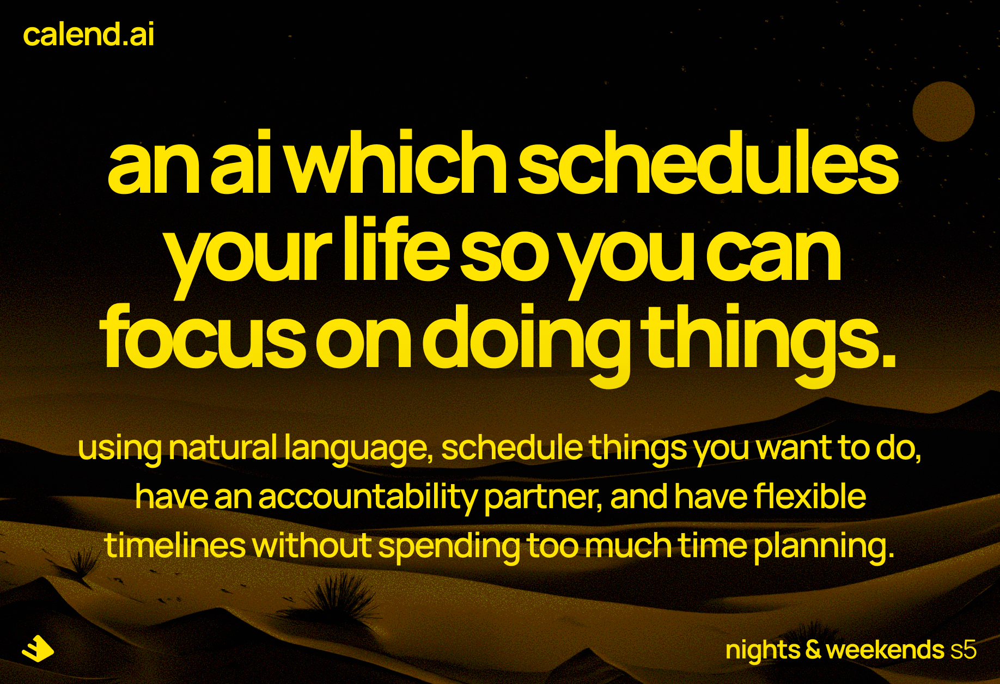

# CalendAI

CalendAI is a Google Chrome extension that helps you plan your days using natural language. It uses Google Calendar to schedule events and has a conversational interface to help you plan your days.

## Join the waitlist

soon:tm:

## Plan your days using natural language

1. Chat with CalendAI about the things you need to get done.
2. CalendAI will suggest a timeblocking schedule for you.
3. CalendAI will schedule events in your Google Calendar for you.

## Current features

-   [x] Understand natural language text
-   [x] List, create, update, and delete events in Google Calendar
-   [x] Have conversations with the user

## Roadmap

-   [ ] Add audio and image input
-   [ ] Improve suggested schedules based on different structures
-   [ ] Improve history and context handling of conversations

## How to use

1. Download the latest release
2. Open Google Chrome and go to `chrome://extensions`
3. On the top right, enable Developer mode
4. Load the unpacked extension
5. Open the extension and sign in with your Google account
6. Start chatting with CalendAI

## Notes

-   This project is still in development and is not yet available on the Chrome Web Store.
-   Your Google Email needs to be whitelisted to use the extension. Use the waitlist form to get whitelisted.
-   None of your data is stored or used for any other purposes than scheduling events in your Google Calendar.
